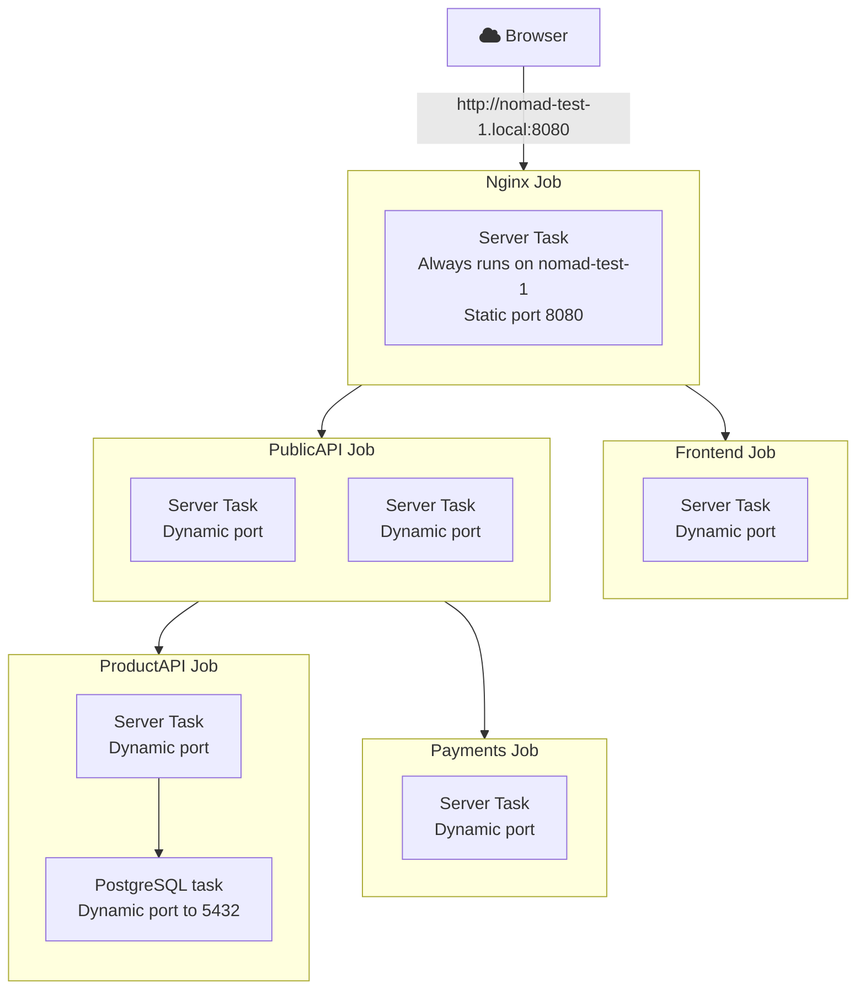

# HashiCups

This example is adapted from
[https://github.com/hashicorp-demoapp/hashicups-setups](https://github.com/hashicorp-demoapp/hashicups-setups/blob/main/nomad/hashicups.nomad).

Once all jobs are running, HashiCups is accessible at
http://nomad-test-1.local:8080.

## Architecture



## Setup

Some of these jobs here have clear dependencies on other jobs; as such, we need
to launch the dependent services before those that depend on them (see diagram
above).

### Order

1. Payments
2. Frontend
3. ProductAPI
    - The productAPI job requires a Nomad variable for storing it Database
      credentials. The `create_nmoad_variable_input` shell script can be used to
      aid creating this: 

      ```shell
      $ ./create_nomad_variable_input.sh \
        | nomad var put -in json nomad/jobs/productAPI -
      ```
    - After the variable is created, the job can be run as normal.
4. PublicAPI
5. Nginx

Each job can be run using `nomad job run <spec file>`.
